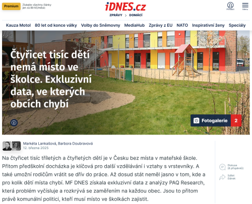

## Phishing Detection on Webpages in European Non-English Languages Based on Machine Learning

This code improves machine-learning phishing detection **on local webpages** in these countries: Czech Republic (CZ), Denmark (DK), Estonia (EE), Croatia (HR), Hungary (HU), Lithuania (LT), Latvia (LV), Poland (PL), Romania (RO), Serbia (RS), Slovakia (SK), and Slovenia (SI)

Specifically, it addresses the issue where state-of-the-art phishing detection models trained on generic datasets have a high false positive rate on webpages in the languages spoken in these countries

The phishing detection reduces the false positive rate on local webpages in these countries

Example of a local webpage URL in a minor language https://www.idnes.cz/zpravy/domaci/materska-skola-nedostatek-mist-ministerstvo-obce-mesta.A250311_194632_domaci_stud?zdroj=otvirak

## Instructions for reproducing results

1. Clone the repository
2. Install Jupyter Notebook
3. Run the notebook `phishing-detection-language.ipynb`

## Instructions for real-world phishing detection

1. Detect the webpage language, e.g., using `lingua-py`
2. IF the language is **Czech, Dutch, Estonian, Croatian, Hungarian, Lithuanian, Latvian, Polish, Romanian, Serbian, Slovak, or Slovene** use the phishing detection from this work to verify the webpage is not phishing
3. ELSE use any state-of-the-art phishing detection to verify the webpage is not phishing

## Source code and results

Source code [phishing-detection-language.ipynb](phishing-detection-language.ipynb)

Raw phishing detection outcomes, organized by country [result-raw](result-raw)

Confusion matrices, word clouds, and false positive analyses categorized by country [result-figures](result-figures)

Webpages with refined phishing predictions [result-improved](result-improved)

Full phishing detection reports for each country [result-reports](result-reports)

## Datasets

Two million benign webpage URLs, categorized by country [benign-urls/urls-*country](benign-urls) 

One million generic webpage URLs [benign-urls/urls-GENERIC](benign-urls)

One million phishing webpage URLs [phishing-urls](phishing-urls) 

## Acknowledgements

Benign URLs from [Common Crawl](https://commoncrawl.org/terms-of-use)

Phishing URLs from [Phishing.Database](https://github.com/mitchellkrogza/Phishing.Database)
